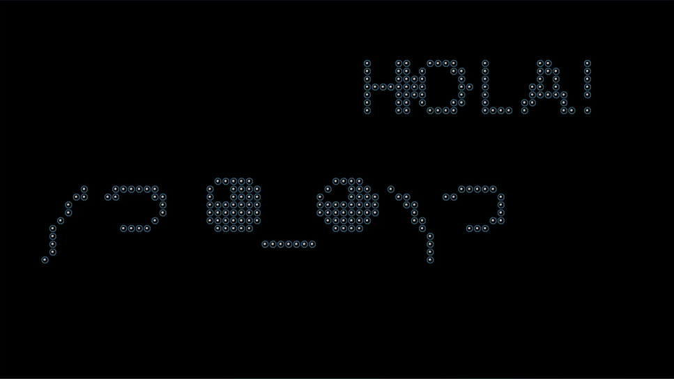

# **ESPAÑOL** 
# **Desarrollado por Nicolás Cabrera Rodríguez**
# 🫧 **Texto animado con efecto de burbujas** 🫧



## Tenemos los siguientes **campos** a destacar:

 ### **Colision con el raton**

 Aqui se esta creando una constante con el nombre *MOUSE*, que tambien es un objeto con los valores:

     x: Establece la posicion del raton en el eje x.
     y: Establece la posicion del raton en el eje y. 
     radius: Establece el radio del raton.

 ### **Evento para detectar el movimiento del raton**

 Creamos un evento 'addEventListener', para que nos establesca la posicion del raton.

 ``` javascript
 window.addEventListener('mousemove', (event) => {

  MOUSE.x = event.x; // establece la posicion X del raton

  MOUSE.y = event.y; // establece la posicion Y del raton
});
 ```

 ### **Estilo del texto**

En este apartado podemos editar el texto mostrado en pantalla.

```javascript
CTX.fillStyle = '#fff'; // establece el color del texto

CTX.font = '10px Arial'; // establece el tamaño del texto

CTX.fillText('HOLA!', 40, 15); // establece el texto

CTX.fillText('༼ つ ◕_◕ ༽つ', 0, 30); // establece el texto

const coordenadasTexto = CTX.getImageData(0, 0, 100, 100); // establece el texto
```

 ### **Clase Particula**
  Creamos una clase Particula.

Dentro de la clase particula tenemos un **draw**( Se utiliza para dibujar las particulas)

Tambien tenemos un **update** que usaremos para actualizar la posicion de las particulas.

 ### **Funcion para crear las particulas**

Esta funcion vacia el array de particulas y las vuelve a crear, segun en la posicion x/y en la que se encuentren.


 ### **Funcion para actualizar la particula**

Actualiza la posicion de las particulas

 ### **Funcion para conectar las particulas**

Calcula la distancia entre las particulas y las mueve.

># **ENGLISH**
# **Developed by Nicolás Cabrera Rodríguez**
# 🫧 **Animated Bubble Text** 🫧


## We have the following **fields** to highlight:

  ### **Collision with the mouse**

 Here we are creating a constant with the name *MOUSE*, which is also an object with the values:

     x: Sets the mouse position on the x axis.
     y: Sets the mouse position on the y axis.
     radius: Sets the radius of the mouse.

 ### **Event to detect mouse movement**

 We create an event 'addEventListener', so that we establish the position of the mouse.

 ``` javascript
 window.addEventListener('mousemove', (event) => {

  MOUSE.x = event.x; // set the X position of the mouse

  MOUSE.y = event.y; // set the Y position of the mouse
});
 ```

 ### **Text style**

In this section we can edit the text displayed on the screen.

```javascript
CTX.fillStyle = '#fff'; // set the color of the text

CTX.font = '10px Arial'; // set the size of the text

CTX.fillText('HELLO!', 40, 15); // set the text

CTX.fillText('༼ つ ◕_◕ ༽つ', 0, 30); // set the text

const textCoordinates = CTX.getImageData(0, 0, 100, 100); // set the text
```

 ### **Class Particle**
  We create a class Particle.

Inside the particle class we have a **draw** (It is used to draw the particles)

We also have an **update** that we will use to update the position of the particles.

 ### **Function to create the particles**

This function empties the array of particles and recreates them, depending on the x/y position they are in.


 ### **Function to update the particle**

Update the position of the particles

 ### **Function to connect the particles**

Calculate the distance between the particles and move them.
